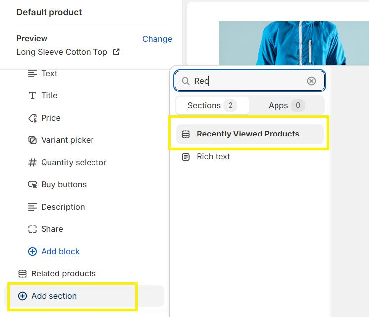

# Dawn theme customisation with dynamic recently viewed items

## Installation

The section can be installed and activated by adding a new section in the product template, search for Recently viewed products.
The section name is set as Recently Viewed Products

## Customization

### Section Settings

#### Full width option

There is a checkbox to enable the section as full width, by default the section is unchecked and set with the template width.

Checking this checkbox will make the section full width

#### Heading

The text for the heading for the section can be customized by adding the required text in the rich text field. The heading can also include dynamic contents like product title. This can be enabled by clicking on the icon.

The size of the header can also be customized by selecting the required size for the Heading size dropdown, by default it is set to Small, the available sizes is as follows

_Note: The header will display only if the section is active._

#### Section padding

The top and bottom padding of the section can be adjusted by selecting the appropriate value using the range sliders.

#### Section background

The background for the entire section can be assigned using this color picker, this can also pick dynamic color values like brand primary color using the icon.

### Product card settings

#### Grid gap

The gap between the product cards can be customised from 0px to 50px using the Gap selection slider

#### Margin and Padding

In order to maintain the uniformity of the product cards, the margin and padding are kept uniform, the value for the margin and padding can be selected using the respective selection sliders.

_Note: it is recommended to use either the Gap or Margin as virtually the act almost the same, hence the margin value is by default set to 0px_

#### Product card background

The background for the individual product cards can be assigned using this color picker, this can also pick dynamic color values like brand primary color using the icon.

#### Product title size

The size of the product titles can also be customized by selecting the required size for the Product title size dropdown, by default it is set to Medium, the available sizes Small, Medium, Large, Extra Large.

#### Button style

The style of the button can be customised by selecting either the primary or secondary button style option. This will make the button get the style of the primary/secondary button style set in the theme.

#### Card hover effect

A small hover effect is added to card, that if enabled, on hover the product cards which are not hover will have a black and white effect, where the hovered product will have color. This is disabled as default.

## Screenshots

Section Selection

Section Settings

Section Preview

Section Hover effect -

## Authors

- [@soorajkabeer](https://github.com/soorajkabeer)
